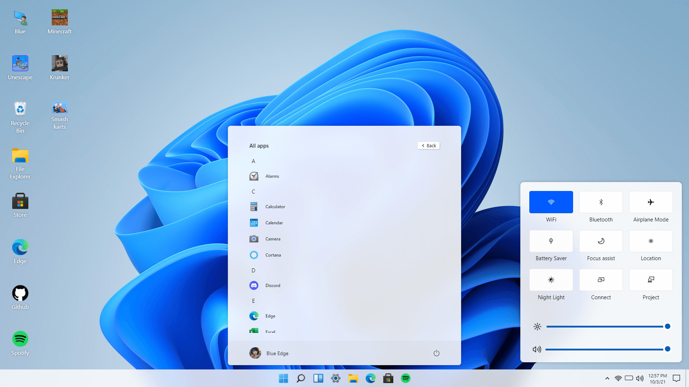
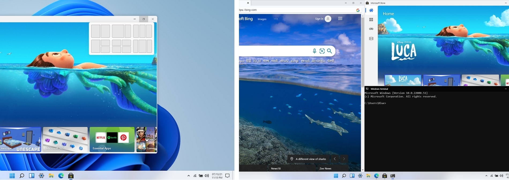
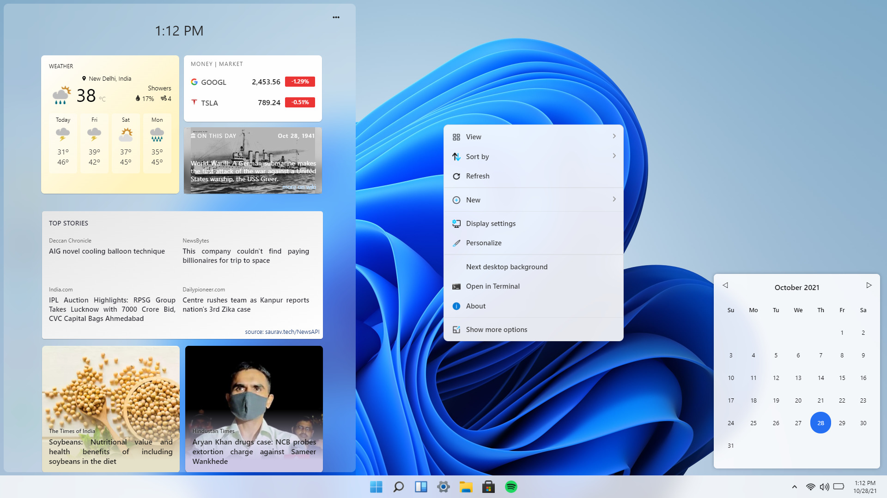

# Win11 in React!

This open source project is made in the hope to replicate the Windows 11 desktop experience on web, using standard web technologies like React, CSS (SCSS), and JS.

## Notice
>#### This project is **not affiliated with Microsoft** and **should not be confused with Microsoft’s Operating System or Products.**
>#### This is also not **Windows 365 cloud PC.**

 #### Live Experience: [win11.coderable.studio](https://win11.coderable.studio)

# Gallery

# Why

WHY NOT? Why not just waste a week of your life creating a React project, just to cover up your insecurities of how incompetent you are. Just why not!

# Features
- [x] Start Menu, Search Menu and Widgets
- [x] Desktop and Right Click action
- [x] Side Navigation and Calendar View
- [x] Snap windows in different layouts
- [x] Browser, Store, Terminal, Calculator
- [x] Notepad, Vscode, Whiteboard
- [ ] File Explorer + Setting
- [x] Drag and Resize windows
- [x] Startup and Lock screen
- [x] Themes and Background

📑 [suggest more](https://github.com/blueedgetechno/win11React/issues/new/choose)

# Stack

- Framework - React (^17.0.2) + Redux
- Component/UI Library - None!!
- Styling Solution - SCSS and CSS Modules (tailwind).
- Icons - fontawesome

## FAQ

- Is this the full operating system?
  - No, This is not a full operating system and It is also not affiliated by Microsoft in anyway.

- How long did it take? 
  - Honestly It took 2-3 days collecting assets, 2-3 planning and about 6 days programming it.

- Did you use any UI/Library?
  - No.

- Where did you get the inspiration from, if you have?
  - I got the inspiration from [this youtube video](https://www.youtube.com/watch?v=OtOmxa9UMe8).

- What is the answer of Life, the Universe, and Everything?
  - 42

    

### Known Issues

- Blur not working in Firefox browser.

###### Solution:

1. Open `about:config` in your firefox browser.
2. Search for `layout.css.backdrop-filter.enabled` and set it to `true`.

## License

⚖️ CC0-1.0 License
